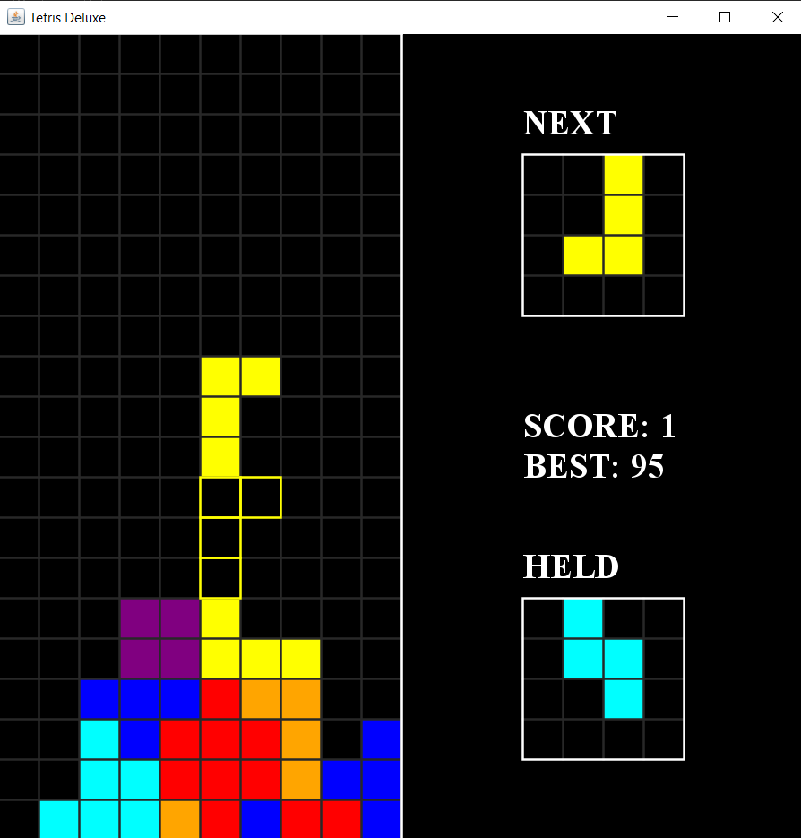

# Java-Tetris

This is Java implementation of classic game Tetris.

The Game includes all functionalities from original game like showing next shape and holding a shape. I also added Highscores, vintage audios, clear animations and dialogue boxes.

I used Java Swing Library for GUI and threads for smoother experience. I hope you like it.;)

Controls: 
A : Move left 
D : Move right 
S(Hold) : Move down faster 
Space : Rotate shape 
H : Hold shape 

